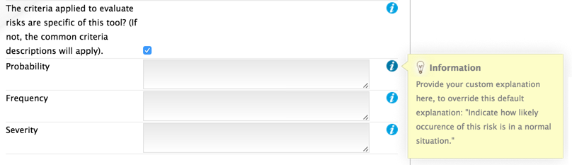

==========================================
A Guide to creating a Risk Assessment tool
==========================================

.. _introduction:

1. Introduction
===============

Your goal is to create the content of the OiRA tool for enterprises in your sector, and to offer this sector-specific tool to them.
The OiRA tool promotes a stepwise approach to risk assessment and is made up of 5 steps:

  * **Preparation** > the sector introduces the end-users (enterprises) to the risk assessment

  * **Identification** > the end-user goes through the hazards/problems and answers YES or NO

  * **Evaluation** (integrated into Identification) > the end-user evaluates the risks for each problem/hazard spotted

  * **Action plan** > the end-user fills in an action plan with measures to tackle all stated risks

  * **Report** > the action plan becomes a report to be downloaded and printed

1.1 Keep in mind your end-user
------------------------------

It is important to **keep in mind your end-user: the micro and small sized enterprise (employer and worker(s)) and the structure** of the risk assessment tool should be as relevant as possible to the daily activities of the enterprises; the end-user thinks and acts in terms of his own business processes.
Often, the expert’s way of thinking differs from the practice of the end-user. The latter thinks in terms of his own work processes and uses his own language. Some examples:

  * the expert thinks of physical workload; *the end-user of physical work*

  * the expert thinks of the thermal environment; *the end-user of working in the heat or in the cold*

  * the expert thinks of safety and creates a module containing everything in that area; *the end-user may think of opening and closing a shop, for example, and what that involves, or dealing with aggressive customers and what to do about them.*

1.2 Use simple language
-----------------------

**Structuring the content of the risk assessment tool so that it is in line with the way the average end-user thinks and acts** makes the content recognisable, and it makes it easier to carry out an action plan to tackle the risks with feasible measures.

Another decisive aspect is the language used. The **language** should be easy to understand with no need for interpretation, referring to things by names that are familiar and common to enterprises.

Short sentences (at best no longer than ten words) and clear everyday language that can be easily read by the layman will prevent the end-user from developing an aversion, and enable him to draw up an assessment and use the OiRA tool properly.

At the beginning of the tool you will be given the chance to write a short introductory text sending a positive **and encouraging message** regarding:

  * the **importance** of risk assessment

  * the fact that risk assessment is **not necessarily complicated** (the idea is to demystify risk assessment)

  * the fact that the tool has especially been conceived to **meet the needs of the enterprises** in the sector

It is important that the text is not too long; otherwise it could discourage the end-user from using the tool.

2.Team
======

Although it is important to keep the project team manageable in terms of size, it should preferably consist of:

  * representative(s) of the trade association(s)

  * representative(s) of the trade union(s)

  * the OiRA developer

  * an expert in occupational safety and health  (with knowledge of and affinity with the sector)

  * end-users (e.g. management or staff from companies, trade unions officials, etc.)

3. Structure
============

3.1 Structure the content hierarchically
----------------------------------------

Before you start creating an OiRA tool, we recommend considering the number of matters which you want to address. Thorough consideration of the structure will pay dividends later on, so classify the subjects in a way that is relevant to end-users.

The system offers a way to group topics, subtopics and types of risks together. The main goal of this grouping is to make it easier/more logical for the end-user to complete the risk assessment tool. Your risk assessment tool will therefore consist of:

.. image:: images/creation/module.png
  :align: left
  :height: 32 px

**MODULES** = subjects *(logical structure; e.g. locations, activities, …)*

  *Example*:
    1 *Hair Shampooing*  (hairdresser sector)

  .. image:: images/creation/submodule.png
    :align: left
    :height: 32 px

  **SUB-MODULES** *(optional; e.g. for more finegrained groupings)*

    *Example*:
      1.1 *Working posture*

      1.2 *Contact with water and cosmetic products*

    .. image:: images/creation/risk.png
      :align: left
      :height: 32 px

    **RISKS** = statements about a situation which is in order

      *Example*:
        1.1.1 *The shampoo station is adjustable*

        1.2.1 *Suitable protective equipment, such as disposable safety gloves, is purchased*

      .. image:: images/creation/solution.png
        :align: left
        :height: 32 px

      **MEASURES** = preventive measures to solve the problem recommended by the expert

        *Example*:
          *Taking regular breaks to be able to recover from physical work*

          *Using dust-free products*

--------------

**PROFILE QUESTIONS**

The OiRA system also offers a special kind of module called a *Profile Question*.

*Profile questions* are similar to modules in the sense that they also
can contain sub-modules and risks and provide structure to the OiRA tool.

They however differ from normal modules in two respects:

* **They may be skipped**

    Profile questions are used to determine whether particular modules or risks
    apply to the end-user at all.

    If the end-user answers *"no"* to a profile question, its contents will be
    skipped, and otherwise evaluated.

* **They may be repeated**

    If a end-user has indicated that a profile question's content applies to a
    them, they must also indicate to how many instances or occurances it
    applies.

    For each occurance that the end-user identifies, the contents of the profile
    question will be evaluated.

The questions that determine whether a *profile question* is evaluated and/or
repeated, are asked during the **Preparation** phase (see the introduction_),
i.e. **before** the end-user starts identifying and evaluating risks,
which only happens in subsequent phases.

To illustrate this by way of example:

.. image:: images/creation/creation_example_profile_question.png
  :align: center
  :height: 500 px

3.2 Think about the risk as an affirmative statement
----------------------------------------------------

Once you have decided about the main structure of the risk assessment tool you can start to identify and explain the various risks.

The system works with **affirmative statements**; that is, it states **whether a situation is ‘in order’ (the goal to be attained) or ‘not in order’;**

**Example:**
    *Good lighting is present*

The end-user's answer is either a clear *'yes'* or *'no'*.

If the end-user answers *'no'* (i.e. the situation is not in order),
then a potential hazard/problem has been identified and the risk will automatically appear in the **Action
Plan** phase, where the end-user will have to propose measures to reduce the
risk.

3.3 Consider the different types of risks
-----------------------------------------

You can choose from 3 types of risks:

    #. **Risk**: refers to existing risks in the workplace or is linked to the work carried out.

        **Example:**
            *All office chairs are adjustable*

    #. **Priority risk**: refers to a risk considered by the sector to be among the high risks in the sector.

        **Example:**
            *Working at height in the construction sector: the scaffold is erected on a firm foundation*

        .. note::

            To identify and evaluate the above two types of risk it is often necessary to examine the workplace
            (to walk around the workplace and look at what could cause harm; consult workers, etc.).

    #. **Policy**: refers to agreements, procedures, and management decisions regarding OSH issues.

        **Example:**
            *Manufacturers are regularly asked about alternative safe products*

        .. note::

            These policy statements can be answered from behind a desk (no need to examine the workplace).

3.4 Evaluating the priority of a risk
-------------------------------------

Problems/hazards (i.e. risks) that have been identified by the end-user,
generally need to be assigned a priority.

#. Risks of type **Policy Risk** are strictly speaking not risks and therefore don't receive a
   priority value.

#. Risks of type **Priority Risk** automatically receive a priority of *high* and are displayed a
   such in the *action plan*.

#. Risks of type **Risk** will also receive a priority value, and this
   value may be attained in roughly three ways.

    In this case, the way the priority is determined, is called an *evaluation method*.

    For each risk (of type *Risk*) you create in the OiRA tool, you may choose from 3 evaluation methods:

    * **Skip evaluation**:

        In this case, the content creator must set the priority beforehand (i.e.
        while creating the OiRA tool's contents) and the end-user will not
        evaluate the risk at all.

    * **Estimated**:

        During the **Evaluation** phase of the OiRA tool assessment, the
        end-user will determine the priority of a risk by selecting a value of **high, medium** or **low**.
        The content creator is able (but not forced), to provide a default priority value, shown to
        the user, which the end-user may choose to keep unchanged.

    * **Calculated**:

        In this case, the risk's priority will be automatically calculated from the
        values of 2 or 3 different criteria, depending on the *evaluation algorithm*
        employed by the OiRA Tool.

        If the evaluation algorithm is the *Kinney method*, then the 3 criteria
        are:

        #. *Probability*
        #. *Frequency*
        #. *Severity*

        If the algorithm is the *simplified, 2 criteria* version, only *severity* and *frequency*
        (sometimes also referred to as *exposure*) are used as criteria.

        The values for these criteria are supplied by the end-user during the
        **Evaluation** phase, although the content creator is again able to provide
        default values.

    Option **"Risk is always present"**

      If this option is selected, then the end-user will always see this risk as being present when they are filling in the OiRA tool in the client. It will behave as if the user had answered "No", but without the possibility that the user can change this answer. All available evaluation methods can be used with this option. Compared to regular risks there are no differences regarding the action plan.

    **Custom explanations for "Calculated" evaluation**

    When the end-user is evaluating a risk that uses the "Calculated" evaluation method, an info-bubble is shown next to the three criteria *Probability*, *Frequency* and *Severity*. This info bubble explains in a short sentence the meaning of the criteria, using pre-defined sentences.

    In case the tool creator wants to provide a more specific explanation to the users of their OiRA tool, they can to this on the edit-form of a tool (see :ref:`edit-oira-tool`). At the bottom of the form, there is a checkbox that reads "The criteria applied to evaluate risks are specific of this tool? (If not, the common criteria descriptions will apply)." If it is ticked, a field appears for each of the criteria, where the custom texts can be entered. Next to each of those fields, an info bubble shows the default explanation that would be used if no custom explanation is given:

3.5 Propose measures
--------------------

The sector is generally well-informed of the risks that are most likely to lead to occupational accidents and diseases.
In order to help the end-user to find ways to mitigate these risks, you can include measures recommended by the sector/experts.
While working on the action plan, the end-user will have the possibility to select the measures and rework them (modify the text)
according to the situation that prevails in their enterprise.

.. note::

  All the necessary documents are available on the OiRA community site http://www.oiraproject.eu/doc/
