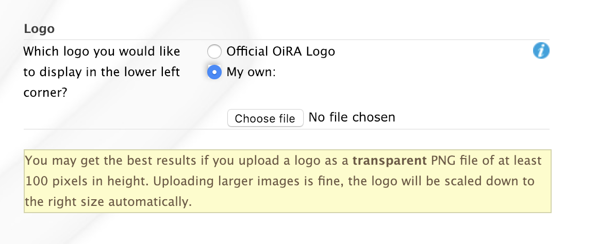

.. header:: OiRA tools generator Manual

***************************
OiRA tools generator Manual
***************************

=======
General
=======

This manual as about the ‘admin’ website (CMS) of the OiRA risk assessment
platform, i.e. where developers create risk assessment tools that will be
displayed on the ‘client’ website of the OiRA risk assessment platform,
where end users (enterprises) access OiRA tools to perform a risk assessment.

--------
Browsers
--------

Preferred web browsers to access OiRA (both admin and client) are:

* Google Chrome version 70 or later
* Safari version 12 or later
* Mozilla Firefox version 60 or later
* Microsoft Edge
* Microsoft Internet Explorer 11

    .. note::

      All versions of Internet Explorer lower than 11 are not supported!

-----------------------
Types of Login Accounts
-----------------------

There are two types of Login Accounts in OiRA:

    * The country manager account: this account has to be created by EU-OSHA
      and will allow the country manager to create sector(s) in their own country

    * A sectoral account: for countries/organisations for which the country
      manager does not apply, EU-OSHA will create a sectoral account

In both cases, EU-OSHA needs to create the account first, if it is not already present because it is used for other OSHA sites such as the OiRA community site or the OSHWiki. Once your account has been created you will receive an email, at the provided address, containing the login information. Please note: Both your user name and password are case sensitive!

Country managers can create sectors by clicking the tab “User management”
and then *Add new sector*

.. figure:: images/editor/editor_add_sector.png
    :align: center
    :alt: A country manager can create sector.

In order to promote a user to a sector manager, the country manager needs to enter this sector, and then use the “LDAP“ tab. There, the country manager can search for the target user and use the *Grant roles* button.
For any current user who has the Sector Manager role, the *Revoke roles* button can be used to remove this role again.

.. figure:: images/editor/editor_assign_sector.png
    :align: center
    :alt: A country manager can grant and revoke the Sector Manager role

In similar fashion, any user can be made a Country Manager via the “LDAP” tab on a country. This action can only be performed by an OiRA administrator.

.. figure:: images/editor/editor_assign_country.png
    :align: center
    :alt: A site administrator can grant and revoke the Country Manager role

----------
Logging in
----------

You start on: https://admin.oiraproject.eu

.. figure:: images/editor/editor_1_login.png
    :align: center
    :alt: The OiRA tools generator login form

    *The OiRA generator login form*

Log in with your User Name and Password.
Did you forget your password? Click at the
bottom of the page on 'request a password reset'.
Then add your user name and click on 'Send'.

   .. figure:: images/editor/editor_2_password_reset.png
      :align: center
      :alt: The OiRA generator password reset form

      *The OiRA generator password reset form*

You will be redirected back to the login page and a green bar will appear,
confirming that the password will be sent to the email address you provided.

   .. figure:: images/editor/editor_3_password_reset_confirmation.png
      :align: center
      :alt: The OiRA generator password reset confirmation

      *The OiRA generator password reset confirmation*

If your login has been successful, a green bar with a confirmation will appear.

After logging in with a country manager or sector account, you will
automatically be taken to the respective country or sector.

   .. figure:: images/editor/editor_4_loggedin.png
      :align: center
      :alt: A sector overview page, after logging in

      *A sector overview page, after logging in*

Here you can: click on a tool to edit it, or start a new OiRA tool by clicking on  --> 'Add New OiRA tool' at the bottom of the page.

-----------
Logging out
-----------

Don't forget to log out when you stop working in the OiRA tools generator. This is done with
the button in the top right-hand corner: click on your login name and select 'Logout'.
After logging out successfully, you will be brought back to the login
screen where you will see the notification 'You have been logged out'.

========================
Creating a new OiRA tool
========================

After clicking on 'Add New OiRA tool' you will be brought
to the page below:

.. figure:: images/editor/editor_5_addsurvey.png
    :align: center
    :alt: The new OiRA tool form

    *The “new OiRA tool” form*

When creating a new OiRA tool you can choose from the following three
options:

#. **Create a new OiRA tool from scratch**
    This option is recommended when you already have an existing risk-assessment tool and would like to transfer this to OiRA.

#. **Base my OiRA tool on an existing OiRA tool of my organisation**
    This option is recommended when you are planning to revise the contents of your OiRA tool.

    .. note::

        When dealing with minor amendments, e.g. typos, it would be best to
        implement these in the existing OiRA tool and simply republish it.

#. **Base my OiRA tool on an existing OiRA tool of another organisation**
    You can decide which existing OiRA tool is most suitable for your sector. You can copy and modify it, and thus avoid having to create one from scratch. You have to determine the amendments for your own sector. For example, the butcher could copy and modify the OiRA tool of the fish retailer.

    .. note ::

        After you've copied an existing OiRA tool, any changes made to the 'source' OiRA tool will not automatically be reflected in your own OiRA tool. When, for example, the butcher has copied the OiRA tool of the fish retailer and the fish retailer implements changes in their OiRA tool afterwards, these changes will not appear in the OiRA tool of the butcher.

If you would like to copy the OiRA tool of another sector as a starting
point, you need to first select the country in the drop-down menu and
subsequently the sector of your choice.

When this sector provides more than one version, you can view these
versions and select one.

Give the OiRA tool a name (title). This name will be shown to the end-user in
the overview. Example: Hairdressers Risk Assessment Tool 2010.

  .. note ::

     It is not possible to change this name later on, since it will be used to create the URL for this tool in the client. In case a change of the tool's name (title) is necessary, please contact EU-OSHA for assistance.

Then click on 'Save Changes' at the bottom of the page.

Your OiRA tool will then be created. Please note that this can take a while
if you've chosen to copy from an existing OiRA tool.

In case of a new (blank) OiRA tool you will see a screen as shown below:

.. figure:: images/editor/editor_6_newsurvey.png
    :align: center
    :alt: A newly created OiRA tool

    *A newly created OiRA tool*

==================
OiRA tool versions
==================

An OiRA tool should be revised periodically, usually to adapt it to the latest
changes in legislation or other environmental changes.
The OiRA tools generator makes this easy by allowing you to create and manage
several different versions of your OiRA tool.

When you create a new OiRA tool, you are creating the first version of the tool.

By default, the first version will always be titled *Standard*.
In the sector overview page, we'll see the heading of the OiRA tool
(here called "New Risk Assessment") as well its first version ("Standard").

   .. figure:: images/editor/editor_oira_tool_versions.png
      :align: center
      :alt: The new OiRA tool together with its first version

      *The new OiRA tool together with its first version*

Having multiple versions is a very useful feature for a variety of reasons.

* Whenever you need to make risky or invasive changes to your OiRA tool, you can create a new version to experiment with, while having the peace of mind that there is still a fully functional copy of the currently deployed OiRA tool.
* Having different versions, together with the preview function, allows easy and rapid prototyping without affecting the OiRA tool currently available to the end-users.
* Once you have tested a new version, you can publish that specific version, thereby replacing the previous one.
* Older versions can be kept for documentation purposes, indicating the history and eventual changes brought to the OiRA tool.

Updating an existing OiRA tool version usually requires you to only do minimal changes to adapt it to latest amendments in legislation or new findings. In this case you don't want to create a new OiRA tool version from scratch but instead copy the old one and make amendments.

**Steps for copying a new OiRA tool version:**

#. Make sure you are on the context of an OiRA tool or one of its versions.
    You will see on the right side a column named **VERSIONS**.
#. Mark an OiRA tool version by clicking on the radio button next to its name.

    .. figure:: images/editor/editor_19_create_new_version.png
        :align: center
        :alt: Creating a new OiRA tool version by copying an existing one

        *Creating a new OiRA tool version by copying an existing one*

#. Click the *Duplicate* button.
#. Provide a Title

   .. figure:: images/editor/editor_20_tool_version_form.png
      :align: center
      :alt: The “new OiRA tool version” add form

      *The “new OiRA tool version“ add form*

#. Make sure the correct base revision is selected. Base revision refers to the version of the tool you want to base the new version on. In our example we only have one version (Standard).
#. Click the *Create* button.

Now you have a second OiRA tool version available and on which you can make changes that won't affect the original version. Once you are done, you can publish it and it will replace the existing OiRA tool in the client.

.. _edit-oira-tool:

============================
Editing an OiRA tool version
============================

When on the context of an OiRA tool version, click the **Edit** button or
hyperlink, to open the edit form.

    .. figure:: images/editor/editor_edit_link.png
      :align: center
      :alt: The location of the edit button and link

      *The location of the edit button and link*

You will then see a form similar to the one shown below.

    .. figure:: images/editor/editor_7_survey_version_edit.png
      :align: center
      :alt: An OiRA tool version edit form

      *An OiRA tool version edit form*

* **Version name**:
    You can modify the version name of the OiRA tool. The name you enter here
    will not be visible to the end-user and is mainly intended to
    help you manage the different versions. When you create a new OiRA tool,
    its first version is automatically created and given the name *Standard*.

* **Summary**:
    A short description of the contents of the OiRA tool. This text will be displayed to then end user.

* **Introduction**:
    Please provide some relevant and encouraging information for end-users of the OiRA tool. For example:

    - The importance of risk assessment
    - The fact that risk assessment is not necessarily something complicated (to demystify risk assessment)
    - **The fact that the tool has especially been conceived to meet the needs of the sector's enterprises**.
        We recommend to specify here which end-users are expected to use the tool
        (*i.e. who is the end-user of the tool?*).

    **Please adapt this text according to your sector needs**, but try to keep it short.

    You may add hyperlinks to pages and files; for example a file containing an employee questionnaire
    which social partners in your sector have decided to be important.

    If you do not edit the Introduction field, the default text will be displayed once the tool is published.

* **Language**:
    Choose the language of your OiRA tool from the drop-down menu. **This action is mandatory**
    in order to ensure that the appropriate language of the OiRA interface is selected.

* **Classification Code**:
    Write the NACE-code of your sector.

* **Type of OiRA Tool**
    This setting determines how an OiRA tool is presented to the user:

    * The **Classic** type will show the risk statement, the Yes / No question, plus the evaluation, where applicable. If the user answers with “No” or if the risk is a priority risk, then the risk will appear in the Action Plan, so that measures to mitigate it *in the future* be defined.

    * An OiRA tool with **Measures already in place** takes different approach: Under the risk statement, the user can state which measures to mitigate the risk are *already in place now*. All “common solutions” provided by the tool creator can be selected, but the user can also describe their own solutions. The Yes / No question follows the list of those measures and asks the user if the already implemented measures are sufficient to take care of the risk, or if further measures need to be planned *for the future*. If the answer is “No, not sufficient”, then risk appears in the Action Plan. That means, this is the same behaviour as for the “classic” type).

    While the type of tool can be changed at any time, it is important to be aware of the effects this has. Special care needs to be taken that the risk statements match the type of the tool.

    For more details on this alternative tool type, see the chapter "XXXX OiRA tool with measures already in place" (t.b.d.)

* **Include a logo which links to an external website**: (Optional)
    Your sector might already have chosen a logo that will appear in the bottom
    left corner of the OiRA risk assessment application.

    This logo can be clicked and links to the homepage of the OiRA risk
    assessment site (https://client.oiraproject.eu).

    There is another option to include a logo which links
    back to a selected web page. This logo will appear on the first page that
    end-users visit as soon as they start with a risk assessment (the Preparation step).

    .. figure:: images/editor/editor_client_example_logos.png
      :align: center
      :alt: An example of the end-user facing OiRA site, showing the two different logos.

      *An example of end-user facing OiRA risk assessment site (OiRA client), showing the two different logos. Logo "1" is the logo pointing to the external organisation that we just entered. Logo "2" is the sector's logo.*

    If you tick the checkbox "Include a logo which links to an external website", 3 more fields will appear.

    * **External site URL**
        This is the URL (website address) of the external website you would like the logo to link to.
    * **External site name**
        This is the name of the website or its organisation
    * **External site logo**
        Here you should provide an image file of the logo

    .. figure:: images/editor/editor_external_logo_fields.png
      :align: center
      :alt: The 3 extra fields for adding a logo linking to an extenal website

      *The 3 extra fields for adding a logo linking to an external website*

.. _custom_estimation_help:

*  **The criteria applied to evaluate risks are specific of this tool? (If not, the common criteria descriptions will apply).**
    With this setting, the hints displayed to the end user when a risk's severity needs to be calculated can be customised.

    On a regular risk that is set to be "calculated" for its severity, the end user is presented with some questions in case the risk is present. The answer to those questions are used to calculate the severity. Next to every question, a help text is available that gives some hints to the user.

    .. figure:: images/editor/evaluation_calculated_standard_hint.png
      :align: center
      :alt: The hint for one of the questions to evaluate the severity of the risk

      *The hint for one of the questions to evaluate the severity of the risk (standard text)*

    In case a tool creator wants to present different hints to the user, they can use this option to set custom texts.

    .. figure:: images/editor/editor_evaluation_calculated_custom_hint.png
      :align: center
      :alt: Entering a custom hint text for the evaluation questions

      *Entering a custom hint text for the evaluation questions*

    The end user will then see this text in the Evaluation box instead of the default one.

    .. figure:: images/editor/evaluation_calculated_custom_hint.png
      :align: center
      :alt: A hint with custom textz for one of the questions to evaluate the severity of the risk

      *A hint with custom textz for one of the questions to evaluate the severity of the risk*

--------------
Formatted Text
--------------

In certain forms in the OiRA tools generator, there exist special, larger
fields in which you can add both plain and formatted text (*also known as rich text*).

You will be able to identify this option from the editor-bar directly above such fields
(the 'formatting bar'). In case there are multiple fields for rich text on a single page,
each of them will have its own formatting bar.

    .. figure:: images/editor/editor_formatting_bar.png
      :align: center
      :height: 410 px
      :alt: Example of a rich text field with the formatting bar above it

      *Example of a rich text field with the formatting bar above it*

It is important that you only copy a not formatted text into the field.
Pasting formatted text from another program, e.g. Word, Excel, etc. may later cause displaying
problems in the OiRA website for end-users (client).
You will not see this code when you paste the text onto the OiRA tools generator, but it does exist
'underneath' the text. Hyperlinks also have a fixed format in Word (colour
and underlining), which is unchangeable after pasting onto the OiRA tools generator. It's
best to implement hyperlinks **after** the text has been entered correctly
into the OiRA tools generator (see the explanation further below for creating links).

Therefore, please **keep in mind that pasting text from another program can cause
unexpected effects**. This applies to all fields in the OiRA tools generator where formatting is possible.
This is why we advise you to type the text into the field without formatting,
instead of pasting from a program. If you decide to paste text from a program, make sure that the text is not formatted.
For instance, you can copy text from a word document to a Notepad document
(Notepad is a standard program available in almost all computers); Notepad
does not support formatting the formatting will be deleted,
and you can copy again from Notepad to OiRA.

The formatting bar offers the following options:

* **Bold**:
    You select (by dragging the mouse) a portion of text and then click **B** in the formatting bar above the field.

    * Selecting the same text again and clicking **B** will undo the bold font (this applies to all formatting options).

* **Italic**:
    You select (by dragging the mouse) a portion of text and click on the **I** in the formatting bar above the field.

    .. note::
        Italicized text is generally not very legible on a screen.

* **Bullet points:**
    You select the required lines and click on the icon with the dots and stripes.

* **Numbered list:**
    You select the required lines and click on the icon with numbers (1-2) and stripes.

* **Hyperlink (to a website):**
    First type the text on which you would like to apply the hyperlink, for example: 'Also see this website'.
    Subsequently you select the text (by dragging the mouse). You then click on the button with the chain icon in the formatting bar.
    A new window will then open, while the rest of the screen appears greyed out:

    .. figure:: images/editor/editor_8_place_a_link.png
      :align: center
      :alt: Adding a hyperlink to formatted text

      *Adding a hyperlink to formatted text*

    * **URL**:
        The address of the web page you want to link to, this must start with: 'http://' or 'https://'.
    * **Text**:
        The title will appear in the tooltip when a person hovers his/her mouse
        cursor above the hyperlink.
    * **Open link in new window**:
        Clicking on the link will open a new web page. By opening that web page
        in a new browser window (or tab), your user will not lose the current
        open page (i.e. the OiRA risk assessment site).

    **To modify a link** or **to delete a link** simple click on the link. A context menu opens with the options to *Edit* (opening the window you already now from adding the link) or to *Unlink* (removing the hyperlink but keeping the text):

    .. figure:: images/editor/editor_8a_edit_a_link.png
      :align: center
      :alt: Adding a hyperlink to formatted text

    .. note::

        URLs are the addresses of websites or web resources. Therefore, if you want to add a
        hyperlink, it must point to a website address. If you would like to offer actual documents
        (e.g. Word or PDF files) on your OiRA tool, you first have to place the documents
        onto a website (e.g. the site of your sector's organisation) and then create a link to these files as described above.

With 'Ctrl-z' (the *Ctrl* key together with the *z* key) you can undo formatting and textual changes you made in the formatted text field
(multiple changes can be undone, as long as you haven't clicked 'Save').

In addition, you can click the right button of your mouse when you are in
a field, which will provide you with an applicable menu. When you select a
word you will also see options such as: cut, copy, paste, etc.

Alternatively, you can use the following keyboard shortcuts:

* Copy: Ctrl-c.

* Paste: Ctrl-v.

* Cut: Ctrl-x.

* Select all: Ctrl-a.

* Undo: Ctrl-z.

* Search (within the field): Ctrl-f.

---------------
Saving the form
---------------

Once you are finished populating the form, click the **Save** button (at the bottom).
This will take you back to the last screen. A yellow bar at the
top will confirm that the item has been modified, which means that the information
has been saved.

======================================
Creating the structure of an OiRA tool
======================================

When completing/modifying the content it's essential to first consider
the structure you will give your OiRA tool.

With structure, we refer to the layout of *profile questions*, *modules* and *submodules*,
as well as their contained *risks* and *measures*.

Within a *module* or *profile question*, you can either add *submodules* or *risks*, a combination of
both isn't possible. You can however add *risks* to a *submodule*.

----------------------------------------------
Copying or moving elements inside an OiRA tool
----------------------------------------------

When you base the OiRA tool on an existing OiRA tool, it will already have a
structure. Main modules and submodules may be added to, or removed from any part of
this structure. You can also copy and move modules, both within the OiRA tool
and to other OiRA tools under your management (visible on the overview on the left).

Click on the item which you'd like to copy or move, and open the menu
*Actions* (top right, next to *Edit*). Choose the desired option, go to the area where you
want to move it (click in the desired OiRA tool and folder) and choose
*Paste* from the *Actions* menu.

    .. figure:: images/editor/editor_paste_item.png
      :align: center
      :alt: Cutting and Pasting items is done from the Actions menu

      *Cutting and Pasting items is done from the Actions menu*

-----------------
Profile questions
-----------------

What are profile questions?
---------------------------

Profile Questions are special modules whose contents may be skipped entirely
or repeated a certain number of times.

Profile questions are posed to the end-user **before** they start the risk assessment, during the preparation phase.

A profile question starts by posing a question, the answer to which will determine
whether the profile question's contents will be skipped or not.

    * *Do you have a store?*

If the end-user answers *No*, the submodules and/or risks inside that profile
question will not appear during the subsequent risk assessment.

If the end-user answers *Yes*, the profile question's contents will be
included in the risk assessment and another question is posed to determine
the amount of times the contents of the profile question needs to be evaluated.

    * *Do you have multiple stores?*

If the end-user answers *No*, they must still provide a name for the single
instance or occurrence referred to by the profile question (in this case, one
store).

If the end-user answers *Yes*, they will be prompted to
provide a name for each of the repeating instances or occurrences (i.e. for
each store).

As you can see, **profile questions enable you to include or exclude certain
parts** of the risk assessment tool, depending on whether they apply to the
end-user's particular situation or not.

They are also **repeatable**, allowing the end-user to name the repeating instances
with names relevant to them (e.g. city centre bakery, bakery headquarters,
bakery city park).

Through this, the (sub)modules and risks associated with
this **repeatable** profile will be repeated in the tool - once for each repeating instance.
Imagine this to be the same as if you would make paper copies of a certain part of
a checklist, because it needs to be completed for each location's characteristics.

Posing profile questions is particularly useful in sectors where it's probable
that a substantial number of modules with risks aren't relevant to all
companies. If you expect that most companies will complete practically all
modules, posing profile questions will be unnecessary, unless you would like to
provide the end-user the option of completing part of the modules multiple times.

.. figure:: images/creation/creation_example_profile_question.png
    :align: center
    :alt: A profile question example

    *A profile question example*

Adding profile questions
------------------------

You can create profile questions as follows: click on the top level of the OiRA tool
(top link in the navigation tree on the left-hand side) and in the grey
bar underneath the title you will find the button *Add Profile Question*.

You will see the following page:

.. figure:: images/editor/editor_10_profile_question.png
    :align: center
    :alt: The profile question add form

    *The profile question add form*

The following fields are available:

    * **Title**:
        The title will appear prominently above the profile question,
        in the beginning of the OiRA tool, during the **Preparation** phase of the risk assessment,
        before any risks are identified or evaluated (the so-called **Identification** and **Evaluation** phases).
        Don't put a full-stop after the title. A number isn't needed either.

    * **Question**:
        This is the question that determines whether the profile question's
        contents will be skipped or not.
        This question appears under the profile question title, at the beginning of the OiRA tool,
        during the **Preparation** phase.

        For example:

            *Does your organisation provide mobile patrolling?*

    * **Multiple item question**:
        This question will be posed to the user only if they have answered *Yes* to
        the preceding question, and must be designed to determine whether the
        profile question contents needs to be repeated or not.

        For example:

            *Do you offer this service in multiple locations?*

    * **Single occurrence prompt**:
        This is the question that will be posed to the user if they have
        answered *No* to the previous question, i.e. there is only one instance
        or occurrence. It must prompt the user to provide a name for that
        single instance/occurrence.

        For example:

            *Please enter the name for the location you want to assess*

    * **Multiple occurrence prompt**:
        This is the question that will be posed to the user if they have
        answered *Yes* to the *Multiple item question*, i.e. there is more than
        one instance or occurrence. It must prompt the user to provide a name
        for each instance/occurrence.

        For example:

            *Please enter the name for each location you want to assess*

A profile question acts as a module, in the sense that it is a container.
You can now add modules and/or risks to it. Do that by clicking the "Add Module" or the "Add Risk" button.

.. figure:: images/editor/editor_10a_add_module_to_profile.png
    :align: center
    :alt: The buttons for adding a risk or module

    *The buttons for adding a risk or module*

=======
Modules
=======

When the module structure is clear and the decision has been made whether
profile questions will be posed or not, it's a good idea to first completely
build the module structure into the OiRA tools generator. Only after that should you
add the risks to the modules. It's not useful to start adding
risks to modules when the structure has not yet been determined.

---------------------------------------
Optional modules
---------------------------------------

Instead of determining which modules apply to the end-user by asking
profile questions, there's also the possibility of initially offering all
modules and giving the end-users the option to skip a module just before starting it.

During the **Identification** phase, while the end-user is going through the
structure and comes upon an optional module, they will be posed a question
designed to determine whether that module is applicable to the specific
end-user (and therefore whether it may be skipped or not).

This so-called 'filter question' for optional modules must be expressed in an affirmative way.

For example:

    *Dangerous substances are used*

As such, the end-user will initially deal with the module *Dangerous
substances*. If the end-user answers with *No* to this statement they will
skip the whole module and its contents.
It isn't possible to skip modules by answering *Yes* to a filter
question, only by answering *No*.

The optional module feature can be used also at sub-modules level.

Take into account that filter questions for optional modules should NOT refer to risks.
For risks you can use the "not applicable"option (see more information below).

Only one filter question may be used for each module/sub-module. It is always the
first question (as affirmative statement) that is displayed in the module.

It's useful to start determining which modules could or should start with
a filter question during the preparation of the module structure.
See below for information on how to enter an optional module.

---------------
Adding a module
---------------

When you are on an OiRA tool, you can create a module by clicking the *Add
Module* button, as shown in the screenshot below.

.. figure:: images/editor/editor_9_creating_modules.png
    :align: center
    :alt: The location of the *Add Module* button

    *The location of the *Add Module* button

You will the see the following form:

.. figure:: images/editor/editor_11_add_module.png
    :align: center
    :alt:  The *Add Module* form

    *The Add Module form*

with the following fields:

   **Title**:
        The title of this module, for instance *Storage room*,
        *Working at height* or *Physical Work*, etc. The end-user will see this
        title at the top of the page for the duration of answering this
        module's risks. Don't put a full stop after the title. A number
        isn't needed either, the module will be numbered automatically.
        Keep it short and simple. Use everyday language and make sure the end-user
        will immediately understand it.

   **Description**:
        Provide a short general description of the contents
        of the module. This is a `formatted text`_ field, so you can create links
        to useful external pages providing additional relevant information.

   **This module is optional**:
        Please refer to the explanation on `optional modules`_ above.

        Ticking this box will make the module optional, determined by the
        answer to a 'filter question' posed to the user.

        If you have decided to make the module optional by ticking this box,
        an extra field labelled *Question* will appear, in
        which you must write the 'filter question' as an affirmative statement.

        The answer has to be *Yes* or *No*. If *No* is answered,
        the end-user will skip the module (as explained above).

   **Image file**:
        You can add an image. It is important to add RGB (*Red, Green, Blue*)
        encoded images and **not** CMYK (*Cyan, Magenta, Yellow, Black*). This is
        important because images will be resized after they have been uploaded. The
        CMYK images change in colour when they are resized. When you have uploaded an
        image and afterwards its colour seems wrong, it might be that you
        have uploaded an CMYK image. Please replace it with an RGB image.

   **Solution overview**:
        At the modular level, generic/orienting solutions could be provided.
        For example it could be important to stress the importance
        of avoiding the risk, substituting the dangerous by the non-(or less)
        dangerous, combating risk at source. The solution could focus
        on different aspects: technical and/or organisational, ...
        The text you enter here will appear in the **Action Plan** phase.
        This Overview of solution at module level should be compatible/complementary
        with the measure(s) proposed at risk level.

Once you've filled in the forms, click *Save* at the bottom of the screen.

To add more top-level modules, click again on the top link in the navigation
tree on the left and then click the button *Add Module*.

To add a submodule to the current module, click on the module where you want to add the submodule.
Then click *Add Submodule* on the top bar.

You can modify modules and submodules as well as all other information you enter
at a later stage by clicking the *Edit* button.
With the Action menu (top right) you can cut, copy and delete modules and
by dragging them (up or down) you can change order of appearance.
You should do this before publishing the OiRA tool.

=====
Risks
=====

------------
Adding Risks
------------

A risk is always placed inside a module, submodule or profile question.
Make sure you are in the correct context by selecting the module, submodule or profile
question from the left-side navigation.

.. note::
    You cannot add risks in the top level of the OiRA tool.

Once on the correct context in which you want to add the risk, click *Add Risk*
in the grey bar underneath the title.

You will then see the following form similar to this (the form might slightly
differ in case you have chosen the 2-criteria evaluation when creating the tool):

.. figure:: images/editor/editor_12_add_risk.png
    :align: center
    :alt: The 'Add Risk' form

    *The 'Add Risk' form*

**Affirmative Statement**:
    Write a short affirmative statement about a possible risk

    For example:
        *The floors are free of obstacles.*

    Put a full stop after the statement.
    For more information on how to properly formulate risk statements, see the section on
    `formulating risks`_ below.

**Negative Statement**:
    This is the inverse of the affirmative statement.
    This field is mandatory as the negative statement will appear in the
    **Evaluation** and **Action plan** steps (i.e. if the end-user answers NO to the affirmative statement).

    Note: the negative statement doesn’t necessarily have to be a simple
    negative version of the positive statement, since saying "no" to the
    positive statement can lead to different conclusions.

    For example:
        - *The floors are not free of obstacles.*

        - *It’s not guaranteed that the floors are always free of obstacles.*

        - *It’s possible, that floors are sometimes occupied by obstacles.*

**Description**:
    Describe the risk and provide the end-user with any relevant
    information. This is a `formatted text`_ field, so you can create links
    to useful external pages providing additional relevant information.

    For example in the statement above, put a clarification/explanation of the exact meaning of
    the type of obstacles you refer to.

**Legal and Policy References**:
    Provide relevant legal information related to the risk/topic/issue.
    This is a `formatted text`_ field, so you can create links to useful external pages providing additional relevant information.

**Identification**:

    * **Show 'not applicable' option**
        If ticked, the user will be presented the possibility to answer with *Not Applicable*.
        Otherwise they only have the options *Yes* or *No*.

        This is useful for risks of which you can't predict whether they will be relevant to the end-user or not.

**Evaluation**:

    **Risk type**:
    There are 3 types of risk which you can choose from.

    Risks that have been identified by the end-user,
    need to be assigned a priority, and the risk's type determines
    what this priority will be or how it will be calculated.

    #. **Priority risk**:
        Refers to a risk considered by the sector/authorities among the high risks in the sector.

        Risks of this type automatically receive a priority of *high*, so
        end-users will not be asked to evaluate them.

        If you choose this option, all subsequent fields under the
        *Evaluation* section in the form will disappear (since they won't
        be applicable anymore).

    #. **Risk**:
        Refers to the existing risks at the workplace or linked to the work
        carried out. To identify and evaluate such risks it is often necessary to
        examine the workplace (to walk around the workplace and look at what could
        cause harm; consult workers, etc.).

        For this "risk" type, the developer has to choose an evaluation method.
        The developer can choose from three options of evaluation methods:

            * **Estimated**:

                .. figure:: images/editor/editor_14_risk_evaluation_estimated.png
                    :align: center
                    :alt: When choosing 'Estimated' as the evaluation method, you also need to set a default priority.

                During the **Evaluation** phase of the OiRA tool assessment, the
                end-user will determine the priority of a risk by selecting a value of **high, medium** or **low**.
                The developer can also choose a **default priority** that will appear to the end users who can nevertheless overrule it.

            * **Calculated**:
                In this case, the risk's priority will be automatically calculated from the
                values of 2 or 3 different criteria, depending on the *evaluation algorithm*
                employed by the OiRA Tool, selected when you create the tool.
                For each criterion the developer can choose a default or
                leave the "no default" option(s). Providing a default
                gives an orientation to the end user how to evaluate the
                risk. However the end-user is always free to overrule the
                default recommendation.

                If the evaluation algorithm is the *Kinney method*, then the 3 criteria
                are:

                **Probability**:
                How high is the probability that this risk will occur?

                **Frequency**:
                How often is one exposed to this risk?

                **Severity**:
                How severe is the danger posed by this risk?

                If the algorithm is the *simplified, 2 criteria* version, only *severity* and *frequency*
                (sometimes also referred to as *exposure*) are used as criteria.

                The values for these criteria are supplied by the end-user during the
                **Evaluation** phase, but you, as the developer, are
                able to provide default values.

                .. figure:: images/editor/editor_13_evaluation_risk.png
                    :align: center

                    *When choosing 'Calculated' as the evaluation method, you may also set the default values for the calculation parameters.*

            * **Evaluation-free**:
                In this case, you must set the priority to a fixed value. The end-user will not evaluate
                the risk at all, because it will not show up in the evaluation phase.

                .. figure:: images/editor/editor_skip_evaluation.png
                    :align: center

                    *When choosing to let the user skip the evaluation, you need to set the priority yourself.*

        Option **"Risk is always present"**

          If this option is selected, then the end-user will always see this risk as being present when they are filling in the OiRA tool in the client. It will behave as if the user had answered "No", but without the possibility that the user can change this answer. All available evaluation methods can be used with this option. Compared to regular risks there are no differences regarding the action plan.

                .. figure:: images/editor/editor_risk_always_present.png
                    :align: center

                    *An info-bubble informs about the consequences of selecting this option.*

    #. **Policy**:
        Refers to agreements, procedures, management decisions regarding
        OSH issues. These issues can be answered behind a desk (no need to examine the
        workplace).

        Risks of this type are strictly speaking not risks
        and therefore won't be evaluated by the end-users (during the
        **Evaluation** phase of the risk assessment).
        They are "high priority" by default.

.. note::

  You can also consult a specific document on Types of risk and evaluation
  methods that recommends when to select which type of risk and evaluation
  method, and the related effects on the client. Available at
  http://www.oiraproject.eu/Resources/technical-guides/types-of-risk-and-evaluation-method

**Main Image and Secondary Images**:

    On the risk page you can add images. One Main image, which will appear on a
    prominent position and up to three secondary images, which will appear below.
    You should use these images to help describe the risk situation and eventually
    also the correct situation as a contrast.

    You will have to upload these images yourself. Make sure that the
    images are clear and legible, not too large
    in surface size (maximum 300 x 300 pixels on the screen) and file size
    (maximum 100 kB). Give the image a clear file name, without spaces (for
    example: Danger_logo.jpg). When the image is ready to upload, select
    it from your computer by using the *Choose file* button. The location and file
    name will appear in the field.

    This function will only allow you to upload images with a 'gif', 'jpeg' or 'png'
    extension. Any other files will first have to be placed onto a website and
    can be linked to from the text.

**Additional Content**

    If you have additional content (files such as PDF, Word or Excel documents) that can help
    explain a risk situation, you can add up to four such documents here. In the OiRA application,
    the user will see a link to each of the uploaded files that allows them to download them. If you provide a caption for a file, this will be displayed to the user, otherwise the file-name
    will be shown:

    .. figure:: images/editor/editor_additional_content.png
       :align: center

Once you are done, click on *Save* (at the bottom of the page).

Formulating risks
-----------------

Risks should have the form of statements. Avoid words such as *not / no / never* in the affirmative statement
(and also in profile questions). Given that the end-user can only answer with
'Yes' or 'No', a statement containing the word 'not' combined with the answer 'No'
can lead to confusion.

For instance, the following statement:

    *There are no obstacles or trailing cables on the floors*

should be reformulated to:

    *Floors are free from obstacles or trailing cables*

When reformulation is not a possibility, try to clarify with an
explanation in the description what will happen when the end-user answers with 'No'.

For example:

    *By answering 'No', there is a risk, when answering 'Yes', there is no
    risk.*

.. note::
    For all statements, the answer 'No' always indicates that there's a risk
    and the answer 'Yes' indicates there isn't a risk.

Any answers other than *Yes* and *No* are not possible, except for *Not
Applicable* if that option has been selected.

----------------------
Solutions and Measures
----------------------

One of the goals of this tool is to help users with information on how to solve
problems they encounter during the process. This is done by providing typical
solutions to general problem areas (by module) or measures for addressing specific problems (by risk).

Solutions - at module level
---------------------------

Edit the module and add the text in the "Solution" field. This text should contain
an approach for the user on how to tackle the risks described in that module in a general way. This
information will be displayed in the Action plan before each specific risk is handled.

Measures - at risk level
------------------------

It is most comfortable for the end-user if you provide a measure for each risk, because
then the user will be able to pick measures with a click to pre-populate the
action plan form.

A measure is related to a concrete risk. First select the
risk in and then click on *Add Measure* in the grey bar.

You will then see the following form:

    .. figure:: images/editor/editor_15_add_measure.png
        :align: center
        :alt: The 'Add Measure' form

        *The 'Add Measure' form*

**Description**:

    This is the heading that will appear in a drop-down in the Action Plan
    phase of the client; it is the first and only information the end-user
    will see before actually selecting the measure, so it needs to be
    informative.
    Start with words which reflect the core message of the
    measure, for example: *Information and instruction on personal protection measures*,
    and then offer the rest. This text helps to get the end-user started
    and explains the possibilities.

**General approach** (to eliminate or reduce the risk):
    Describe what is your general approach to eliminate or (if the risk
    is not avoidable) reduce the risk.
    This text will be incorporated into the Action plan.

    For example:
        *Ensure the correct means of Personal Protection are used, according to...*

**Specific action(s) required to implement this approach**:
    Describe the specific action(s) required to implement this approach
    (to eliminate or to reduce the risk).

    For example:
        * *Appoint person responsible for information on and provision of personal protection measures*
        * *Set a date for an information session and invite staff*
        * *Check if personal protective equipment is sufficient and well maintained*
        * *...etc.*

**Level of expertise and/or requirements needed**:
    Describe the level of expertise needed to implement the measure,

    For example:
        * *Common sense (no OSH knowledge required)*
    or
        * *No specific OSH expertise, but minimum OSH knowledge or training and/or consultation of OSH guidance required*
    or
        * *OSH expert*

    You can also describe here any other additional requirement (if any).
    For example: budgeting, training for Prevention/Safety staff, incorporating
    this subject in team meetings, etc.

If the end-user selects this measure it will be copied over to the Action plan.
The end-users can rework and modify the supplied text.

Once finished, click *Save changes* at the bottom of the page.

It is recommended to add several standard measures to each risk.
You can add them by clicking the *Add Measure* button.

====================================================
Customizing OiRA to reflect your organisation's logo
====================================================

You may customize the way the OiRA risk assessment tool will appear to
end-users to let it reflect your organisation's logo.

.. figure:: images/editor/editor_edit_sector_link.png
    :align: center
    :alt: The 'Edit' link on a sector

    *The 'Edit' link on a sector*

You will then see a form similar to this:

.. figure:: images/editor/editor_16_selecting_colours.png
    :align: center
    :alt: The 'Settings' form for a sector

    *The 'Settings' form for a sector (with a custom logo already present)*

Without customisation, the standard OiRA logo is displayed on the sidebar of the client. But you may also upload your sector's own logo:

Under *Logo* you check the box *My own*, then click on *Choose file* to navigate on your computer for selecting the image to upload. Finally, click on *Save* at the bottom of the page. You can change the image at a later date if needed, or switch back to the standard logo.

For best results, take a transparent 'PNG' file with a height of at least 110 pixels. Larger logos will be resized automatically.

    *Changing the sector logo*

=======================
Checking your OiRA tool
=======================

When all the work has been done, i.e. the structure and contents have been completed,
you can preview your OiRA tool (prior to making it public) following these steps:

#. Make sure you have an end-user account in the OiRA tool (http://client.oiraproject.eu/) You create an account in the OiRA client here https://client.oiraproject.eu/@@register
#. In the *Versions drawer* (see `OiRA tool versions`_) on the right hand, chose the version you want to preview and, click the *Preview* link next to your OiRA tool version.

   .. figure:: images/editor/editor_versions_drawer.png
      :align: center
      :alt: The versions drawer

      *The versions drawer*

#. Then click *Create preview*

   .. figure:: images/editor/editor_preview_confirmation.png
      :align: center
      :alt: The preview confirmation form

      *The preview confirmation form*

#. Click on the Preview URL

   .. figure:: images/editor/editor_preview_status_message.png
      :align: center
      :alt: The preview confirmation form

#. Log into the tool with your end-user account
#. View your (still unpublished) OiRA tool

   .. tip::

     Check as many boxes as possible on the profile page, answer the filter
     questions with 'Yes' and the risks with 'No'. This way you will view all
     risks and possibilities.

   When you discover faults in the preview you can amend these in the OiRA tools generator.
   Access the Preview again to check your modifications.

   .. note::

     The preview is stored in a separate place on the server, it won't be
     viewable to the end-users until you publish the OiRA tool.

===============
Ready? Publish!
===============

Once you've successfully completed all steps it's time to publish your
OiRA tool.

Go to the right hand menu, click on the version of the tool you want to publish and click on "Publish".

.. figure:: images/editor/editor_18b_publish_survey.png
    :align: center
    :alt: Publishing your OiRA tool

    *Publishing your OiRA tool*

.. note::
    It can take some time to perform this action.

When you click on Publish, you will be asked if you are sure you want to publish the tool.
Before confirming, copy the URL (link) of the tool that is provided on this page and
save it in a secure place (after the confirmation, the URL will disappear).
This URL will be the access point of your tool in the OiRA client.

A confirmation message will appear in a green bar:

.. figure:: images/editor/editor_18_publish_survey.png
    :align: center
    :alt: Publish confirmation message

    *Publish confirmation message*

From now on, the public can view and complete your OiRA tool. In case of a
new OiRA tool, contact the OiRA team at EU-OSHA at least two weeks before you
publish the tool. This way EU-OSHA can ensure that your tool will be included
on the OiRA project site (http://www.oiraproject.eu). You don't have to notify
the OiRA team when you have updated the OiRA tool.

===============================
Modifying an existing OiRA tool
===============================

The chapters prior to this are based on creating a new OiRA tool, potentially
on the basis of an existing OiRA tool.

Naturally the process of creating an OiRA tool will be followed by managing
and maintaining your OiRA tool.  At present, the exact same considerations,
focus points and functionalities apply to this process.

After adapting the OiRA tool you check it with the Preview and then publish
it, as described above.

You can create a new version before modifying a tool. See
`OiRA tool versions`_ for more information.

Instead of changing the existing tool you could also create a new tool based
on the existing one, see `Creating a new OiRA tool`_. This may avoid some
confusion for users as the old version does not need to be replaced but
instead a new tool is created under a new URL. However the new tool will have
a completely separate identity, in particular any saved sessions will stay
associated with the old tool, which may not be what you want.

-----------------------------------
Modifying risk and evaluation types
-----------------------------------

If you modify a Risk and publish the modifications this may affect your clients
saved sessions.

Whenever a risk's evaluation method is changed from Calculated to Estimated,
then in the already existing sessions the previously calculated priority value will
be kept. This is independent of whether the new Estimated method gets
default values or not.

If the developer changes a Risk from Evaluated or Calculate to Skip
evaluation, the Risk will not be evaluated when you run the evaluation step.

If the risk type changes from a Risk to a Policy risk or Priority risk,
nothing happens with the saved sessions. In the saved session the risk will
remain a non-policy, non-priority Risk, and it will remain as Evaluated or
Calculated, as before.

--------------------------
Updating of saved sessions
--------------------------

When changes are made to a tool, existing sessions will not be updated
immediately but only when the user goes back to them in the client. (This also
affects the available data for the statistical reports.) At this time the data
will be updated and any newly created, changed or deleted modules or risks
will be taken into account. E.g. answers to deleted risks will be discarded.

Note that only changing the order of risks will not be reflected in existing
sessions unless new risks were also created or existing ones deleted.

-------------------
Unpublishing a tool
-------------------

A tool can be unpublished. Unpublishing makes a tool unavailable in the
OiRA client. Any saved sessions will be retained and can be accessed again if
you re-publish the tool later.

You do not need to unpublish a tool to make modifications.

---------------------------------------------------------
Publishing/unpublishing a tool with a session in progress
---------------------------------------------------------

When a new version of a tool is published while a session is in progress, the
changes will be visible the next time the user's browser loads a page from the
server, i.e. most links and other client controls will make the changes visible
immediately and without warning.

When a tool is unpublished while a session is in progress, the user will get a
"Not found" page. There should probably be some kind of communication before a
tool is unpublished because the user will not see what has happened from this
page.
